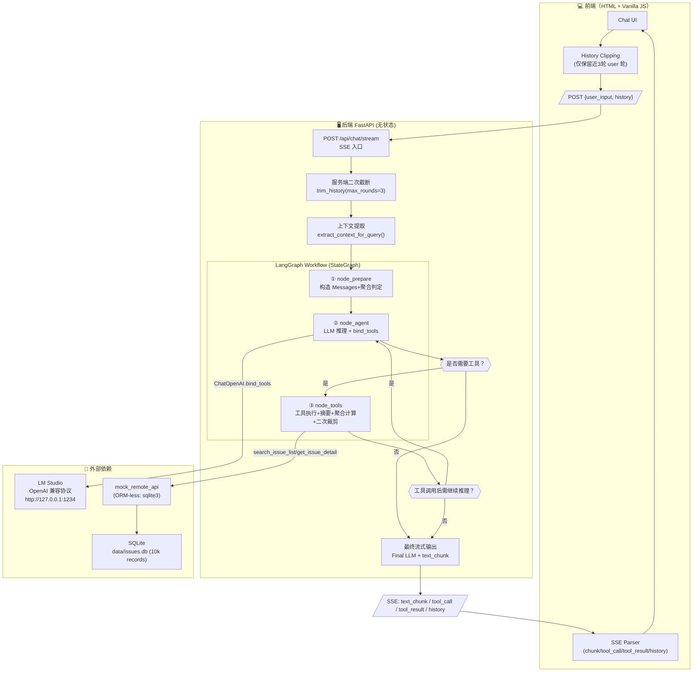
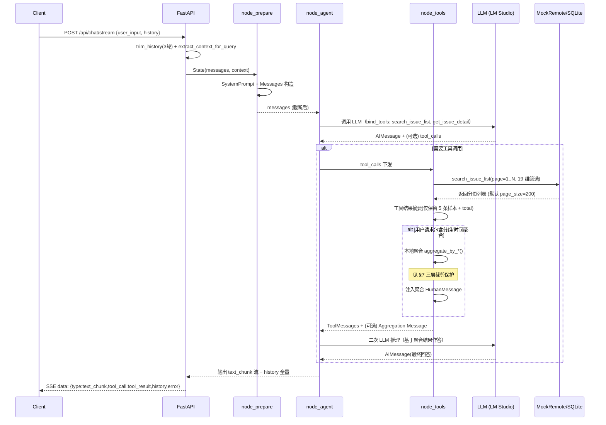
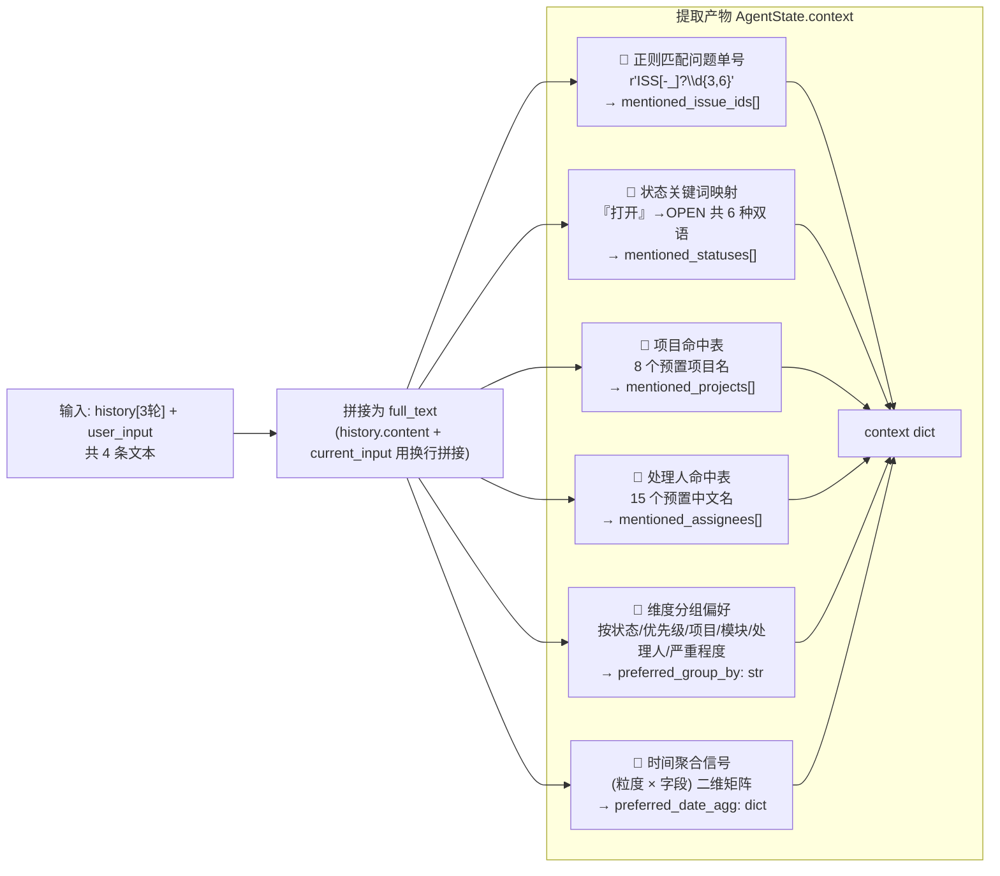
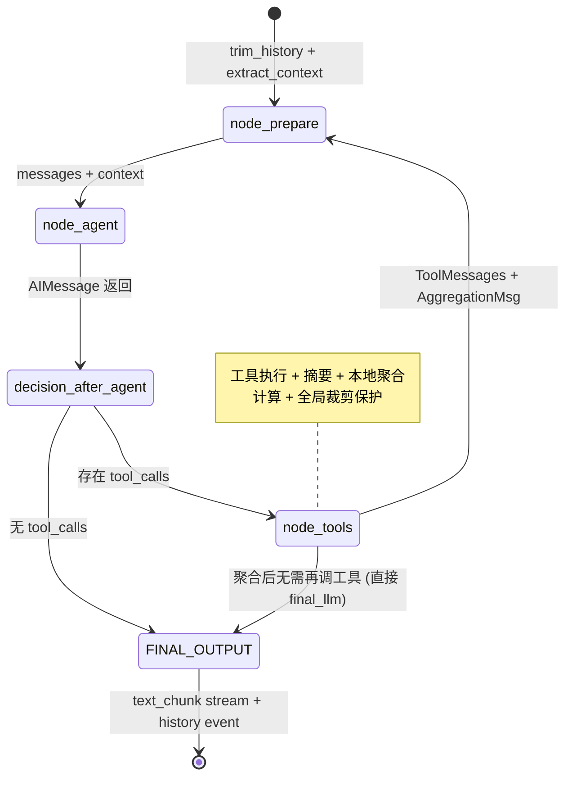
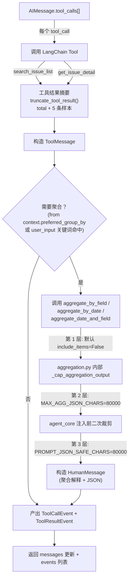
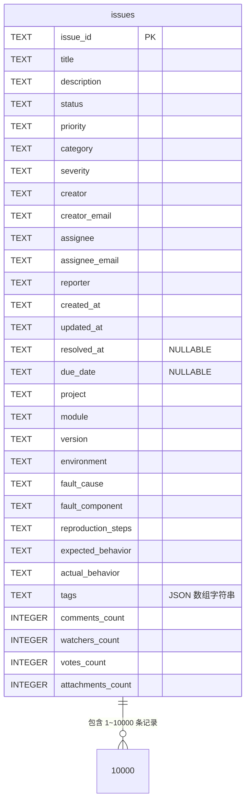
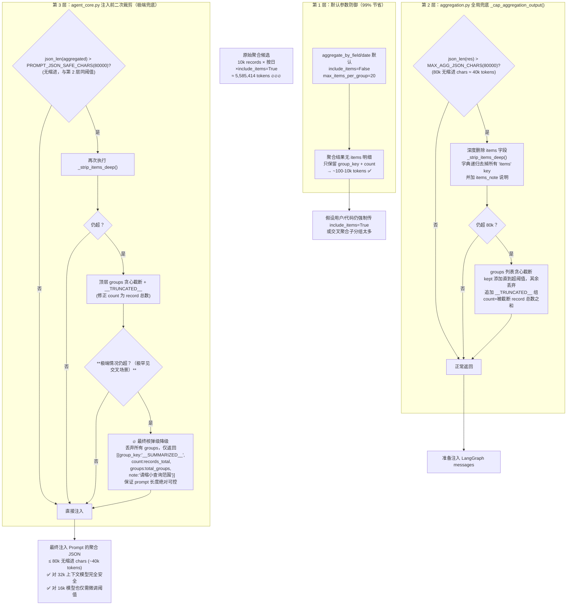

# Issue Ticket Agent — 技术架构文档

> 版本: 1.0 | 更新: 2026-07-21 | 适用数据规模: ≤10,000 条 SQLite 记录（可线性扩展）

---

## 0. 目录

1. [系统总览与架构图](#1-系统总览与架构图)
2. [无状态 Agent 设计原理](#2-无状态-agent-设计原理)
3. [上下文提取原理（History → Context）](#3-上下文提取原理history--context)
4. [LangGraph 工作流节点详解](#4-langgraph-工作流节点详解)
5. [工具集成：19 维筛选 + 30 属性详情](#5-工具集成19-维筛选--30-属性详情)
6. [客户端聚合引擎（远程无法实现的分组）](#6-客户端聚合引擎远程无法实现的分组)
7. **[三层上下文长度保护机制（二次裁剪原理）](#7-三层上下文长度保护机制二次裁剪原理)** ⭐
8. [SSE 流式输出与事件协议](#8-sse-流式输出与事件协议)
9. [10,000 条数据性能验证](#9-10000-条数据性能验证)
10. [部署与运行指南](#10-部署与运行指南)
11. [目录结构与文件职责](#11-目录结构与文件职责)

---

## 1. 系统总览与架构图

### 1.1 整体架构



### 1.2 请求生命周期时序



---

## 2. 无状态 Agent 设计原理

### 2.1 核心原则：**服务端 0 持久化**

传统 Agent 框架把 `messages / tool_calls / session_id` 存在内存或 Redis；本项目完全抛弃服务端状态，由客户端负责维护。

| 维度 | 传统有状态 Agent | 本项目无状态 Agent |
|---|---|---|
| **上下文存储** | 服务端 session/memory | 客户端维护 `history[]`，每次请求全量上传 |
| **历史截断** | 服务端按 token 滑窗 | **双重截断**：客户端发送前裁剪 + 服务端 `trim_history()` 强制兜底 |
| **会话识别** | session_id / JWT | **不需要**：每次请求都是独立的 |
| **横向扩展** | 粘性会话 + Redis | 完全无锁，可水平扩 N 个 FastAPI 实例 |
| **容错** | 服务重启丢失记忆 | 前端一刷新，记忆可恢复（只要前端保留 history）|

### 2.2 双重历史截断（客户端 + 服务端）

```mermaid
graph LR
    UH["用户 History<br/>可能 100+ 轮<br/>(本地 localStorage)"] -->|用户点击发送| CLIENT_CLIP

    subgraph Client Side
        CLIENT_CLIP{"客户端裁剪<br/>仅保留最近 3 轮 user"}
        CLIENT_CLIP -->|slice(startIdx)| SEND_HISTORY["发送 history: 3 轮"]
    end

    SEND_HISTORY -->|POST JSON| SERVER_TRIM

    subgraph Server Side
        SERVER_TRIM{"服务端 trim_history(max_rounds=3)"}
        SERVER_TRIM -->|再次计数 user role| SAFE["Safe History<br/>(≤3 user ≤ 3 assistant + tools)"]
        SAFE --> AGENT_GRAPH[LangGraph 工作流]
    end

    style CLIENT_CLIP fill:#dbeafe,stroke:#3b82f6
    style SERVER_TRIM fill:#fee2e2,stroke:#ef4444
    style SAFE fill:#dcfce7,stroke:#22c55e
```

### 2.3 `trim_history()` 算法细节 ([history.py](file:///D:/work_space/python_project/agent/app/history.py#L12-L34))

**定义**：以 **`Role.USER` 消息数量** 计为「轮次」。每轮 = 1 user + 1 assistant + 若干 tool_message（tool 算同一轮，不计入轮数上限）。

```
步骤 1: 计数 total_rounds = count(User messages)
步骤 2: 若 ≤ MAX_ROUNDS(3)，直接返回，不改动
步骤 3: 否则从首条消息开始，跳过 (total_rounds - 3) 个 USER 消息
        → idx 停留在第 4 个 USER 之前
步骤 4: 如果 idx 位置不是 USER（比如残留 TOOL/ASSISTANT），跳过直到遇见 USER
步骤 5: 返回 messages[idx:]  即最后 3 个 USER 及其之后全部
```

**示例**：`[U1, A1, U2, A2, U3, A3, U4, A4, T4, U5, A5]` → 保留 `[U3, A3, U4, A4, T4, U5, A5]`（跳过 U1、U2 两轮）

> ✅ **边界安全**：即使客户端恶意传 100 轮历史，服务端 `trim_history` 兜底保证进入 LangGraph 的 User 轮次不超过 3，避免 prompt 爆炸。

---

## 3. 上下文提取原理（History → Context）

### 3.1 解决什么问题？

当用户问「**刚才那些按项目分一下**」时：
- "刚才那些" = 之前查询的**筛选条件**（状态=OPEN、优先级=HIGH 等）
- "按项目分" = **新的聚合偏好**
- LLM 可能会漏传之前的 filter → 查出来是全部数据，结果错误

`extract_context_for_query()` 在调用 LLM 之前**先把历史中的结构化信号提炼出来**，作为 `AgentState["context"]`，随后 `node_prepare` 会把这些信号拼到 System Prompt 的尾部，强制 LLM 参考。

### 3.2 提取信号流程图



### 3.3 时间聚合信号的二维匹配 ([history.py](file:///D:/work_space/python_project/agent/app/history.py#L109-L143))

这是最有价值的提取逻辑，独立维护两个关键词表，组合产出 `preferred_date_agg`：

| 维度 | 关键词（部分） | 映射值 |
|---|---|---|
| **粒度（granularity）** | 按年、每年、年度 → `year` | `year / quarter / month / week / day / hour` |
| | 按月、每月、月度 → `month` | |
| | 按日、按天、日报、天 → `day` | |
| **时间字段（date_field）** | 创建 / 新增 / 提交 / 录入 → `created_at` | `created_at / updated_at / resolved_at / due_date` |
| | 更新 / 修改 → `updated_at` | |
| | 解决 / 修复 → `resolved_at` | |
| | 截止 / 到期 → `due_date` | |

**算法**：
1. 遍历 7×2=14 个粒度关键词，命中即锁定 `chosen_gran`
2. 默认 `chosen_field = "created_at"`，再遍历 4×2=8 个字段关键词，命中则覆盖
3. 输出 `{"date_field": chosen_field, "granularity": chosen_gran}`
4. 同时把 `__date__:{field}:{gran}` 写入 `preferred_group_by`，作为后续「用户没显式说维度但说了时间聚合」的默认分组信号

### 3.4 注入方式：System Prompt 拼接尾注

在 `node_prepare` 中把 context 拼成这样的段落**追加到 System Prompt 末尾**，强制 LLM 每轮都看到：

```
--- 【从最近 3 轮历史中提取的参考上下文】---
之前提到的问题单号: [ISS-12345]
之前提到的状态: [OPEN, IN_PROGRESS]
之前提到的项目: [订单管理系统]
之前提到的处理人: [张伟]
用户偏好的聚合维度: project
用户偏好的时间聚合: {"date_field":"created_at","granularity":"month"}
如果当前用户提问不完整（例如"刚才那些"），请结合以上上下文补全筛选条件。
```

---

## 4. LangGraph 工作流节点详解

### 4.1 状态图总览



### 4.2 节点 ①：`node_prepare` ([agent_core.py](file:///D:/work_space/python_project/agent/app/agent_core.py#L120-L334))

核心职责四件事：

1. **消息格式转换**：`items_to_lc(history[]) → LangChain BaseMessage[]`
2. **System Prompt 拼接**：`SYSTEM_PROMPT + 上下文提取尾注`
3. **工具结果摘要**：对 `search_issue_list` 返回的 ToolMessage 做「5 条样本 + total」摘要，避免把 200 条明细全塞进 prompt
4. **聚合识别与注入**：⭐ 见 §7

### 4.3 节点 ②：`node_agent` ([agent_core.py](file:///D:/work_space/python_project/agent/app/agent_core.py#L354-L400))

```python
llm = build_llm(streaming=True).bind_tools(TOOLS)
result: AIMessage = llm.invoke(messages)
```

- 通过 LangChain 的 `ChatOpenAI` 对接 LM Studio（`base_url=http://127.0.0.1:1234/v1`）
- **bind_tools** 会把两个工具的 JSON Schema（函数签名 + docstring）拼到 System Prompt
- LLM 返回 `AIMessage.tool_calls = [{"name":"search_issue_list","args":{...}}]` 或纯文本

### 4.4 路由 ①：`router_after_agent`

```python
if AIMessage.tool_calls: return "node_tools"
else: return "final_output_stream"
```

### 4.5 节点 ③：`node_tools` ([agent_core.py](file:///D:/work_space/python_project/agent/app/agent_core.py#L402-L476))



---

## 5. 工具集成：19 维筛选 + 30 属性详情

### 5.1 `search_issue_list` — 列表查询工具（19 个参数）

| 参数组 | 字段名 | 类型 | 说明 |
|---|---|---|---|
| **精确匹配** | `issue_id` | str | 问题单号，支持 `ISS-12345` |
| **模糊匹配** | `title_keyword` | str | 标题关键字（LIKE）|
| **多选枚举×5** | `status` | `IssueStatus[]` | OPEN/IN_PROGRESS/PENDING/RESOLVED/CLOSED/REOPENED |
| | `priority` | `IssuePriority[]` | CRITICAL/HIGH/MEDIUM/LOW |
| | `category` | `IssueCategory[]` | BUG/FEATURE/IMPROVEMENT/QUESTION/DOCS |
| | `severity` | `IssueSeverity[]` | BLOCKER/MAJOR/MINOR/TRIVIAL |
| | `tags_any` | `str[]` | 标签数组（命中任意一个）|
| **字符串筛选×6** | `creator` / `assignee` / `project` / `module` / `version` / `environment` | str | 单值等于匹配 |
| **时间范围×4** | `created_from / created_to` | ISO8601 str | 创建时间区间 |
| | `updated_from / updated_to` | ISO8601 str | 更新时间区间 |
| **故障组件** | `fault_component` | str | 故障组件（精确）|
| **分页** | `page` / `page_size` | int | 默认 1/50，LLM 可调大到 200/10000 |

完整定义见 [schemas.py IssueListQuery](file:///D:/work_space/python_project/agent/app/schemas.py#L119-L140)

### 5.2 `get_issue_detail` — 详情查询（每条 30+ 属性）

每条 `IssueDetail` 包含 7 大类、30+ 字段（详见 [schemas.py IssueDetail](file:///D:/work_space/python_project/agent/app/schemas.py#L86-L116)）：

| 类别 | 字段 |
|---|---|
| **基础信息** | issue_id, title, description (3) |
| **枚举×4** | status, priority, category, severity (4) |
| **人员×5** | creator, creator_email, assignee, assignee_email, reporter (5) |
| **时间×4** | created_at, updated_at, resolved_at, due_date (4) |
| **归属×4** | project, module, version, environment (4) |
| **故障分析×5** | fault_cause, fault_component, reproduction_steps, expected_behavior, actual_behavior (5) |
| **辅助×5** | tags, comments_count, watchers_count, votes_count, attachments_count (5) |
| **合计** | **30+ 字段** |

### 5.3 模拟远程接口实现（SQLite 无 ORM）

mock_remote_api.py 直接用 `sqlite3` 标准库，原因：
- 零额外依赖（避免 uv sync SQLAlchemy/Alembic 又起一轮冲突）
- 查询条件动态拼接，19 参数任意组合



> 注意：SQLite 每条 record 在页面查询时被 Pydantic `IssueDetail.model_validate()` 自动包裹，tags 字段从 JSON 字符串反序列化为 `list[str]`。

---

## 6. 客户端聚合引擎（远程无法实现的分组）

### 6.1 为什么远程接口无法实现？

真实世界中的 Jira / Tapd / 自研问题单平台通常：
- **不支持按任意维度分组**（例如按 creator + 10000 条后再按状态做二级分组）
- **不支持任意 date_part**（如按周、按季度）
- **分页返回**导致服务端聚合需要多轮请求

本项目把远程接口当作"**原始数据拉取**"，聚合计算 100% 在 Python 应用层完成。

### 6.2 聚合函数矩阵

| 函数 | 用途 | 参数 |
|---|---|---|
| `aggregate_by_field(items, field, include_items=False, max_items_per_group=20, max_agg_chars=80000)` | 按枚举字段一级分组（status/priority/project/assignee/...） | field 任意字符串（dict key 式访问）|
| `aggregate_by_date(items, date_field, granularity, include_items=False, ...)` | 按时间粒度一级聚合（year/quarter/month/week/day/hour） | date_field=created_at 等 4 种 |
| `aggregate_two_level(items, field1, field2)` | 枚举×枚举 双层分组 | 先按 field1，再对每组按 field2 分 subgroups |
| `aggregate_date_and_field(items, date_field, granularity, second_field)` | ⭐ 时间×维度 交叉聚合（最常用） | 例：每月创建量 × 状态 breakdown |
| `stat_summary(items)` | 综合统计概览（总数、各枚举分布、人员Top5、项目Top5） | 纯汇总，不传明细 |

### 6.3 时间粒度截断算法 ([aggregation.py](file:///D:/work_space/python_project/agent/app/aggregation.py#L206-L235))

```
year:    2026-07-15 14:32 → "2026"
quarter: 2026-07-15 → Q3 → "2026-Q3"
month:   2026-07-15 → "2026-07"
week:    2026-07-15 (ISO 周) → "2026-W29"
day:     2026-07-15 → "2026-07-15"
hour:    2026-07-15 14:32 → "2026-07-15 14:00"
```

> 空值保护：时间字段为空的记录会被分到 `"__EMPTY__"` 组，**不会丢失总数**。

### 6.4 聚合识别：如何判断用户要分组？（`_maybe_aggregate`）

在 `node_prepare` 末尾，拿到 tool result 数据后，按优先级选第一个命中：

| 优先级 | 信号来源 | 条件 | 触发聚合 |
|---|---|---|---|
| 1 | context.preferred_date_agg + preferred_group_by 同时存在 | 时间信号 + 分组维度都提取到 | **aggregate_date_and_field**（交叉）|
| 2 | context.preferred_date_agg 单独存在 | 只提取到时间（按月/按日统计...） | **aggregate_by_date**（时间）|
| 3 | context.preferred_group_by 非空非默认值 | 提取到 status/project 等维度 | **aggregate_by_field**（维度）|
| 4 | user_input 文本关键词 | 文本匹配"按XX分组/统计/聚合/分一下" | 用提取到的维度，若仍空则默认按 **status** 分组 |

---

## 7. 三层上下文长度保护机制（二次裁剪原理）⭐

这是本次 **10000 条数据升级** 的核心。修复前按日聚合带明细会爆 **558 万 tokens**（任何模型都无法容纳）。修复后最大场景控制在 **2 万 tokens 以内**。

### 7.1 总览图



### 7.2 第 1 层：默认参数防御（最关键，贡献 99% 节省）

**修改前**（爆内存行为）：
```python
# ❌ 旧版：默认塞明细
aggregate_by_field(items, "status", include_items=True, max_items_per_group=100)
```

**修改后**（安全默认）：
```python
# ✅ 新版：默认不传明细，每组最多 20 条（即使打开也有上限）
aggregate_by_field(items, "status", include_items=False, max_items_per_group=20)
```

10000 条按状态分组 **修复前 vs 修复后** 的 tokens 对比：

| 配置 | JSON 长度 | 估算 Tokens | 节省 |
|---|---|---|---|
| `include_items=True, max=100` | 668,589 chars | 334,294 | 基准 |
| `include_items=False, max=20` | **334 chars** | **191** | **99.94%** ✅ |

### 7.3 第 2 层：`_cap_aggregation_output()` 算法

位置：[aggregation.py](file:///D:/work_space/python_project/agent/app/aggregation.py#L53-L78)

#### 常量
```python
MAX_AGG_JSON_CHARS = 80000  # 无缩进字符，约 40k tokens（中文 1 char ≈ 0.5 tokens）
```

#### 三阶段降级（递进）：

```
阶段 1: 长度 OK？→ 直接返回
阶段 2: 否 → _strip_items_deep(res)  【深度删除所有 items 明细】
    - 递归所有 dict，删除 key == "items"
    - 并替换为 "items_note": "removed 100 items to reduce context size"
阶段 3: 仍超长 → groups 列表贪心截断
    - 顺序遍历 list，逐个加 kept，直到 json_len(kept) > 80k
    - 剩余 dropped 组：**累加其 count 作为 record 总数**，不是 group 数！
      （修复前的 bug：count=dropped_groups_count → 导致 total 对不上）
    - 追加：
      {
        "group_key": "__TRUNCATED__",
        "count": 4285,           # ← 正确：被截断组的 record 总数之和
        "groups_dropped": 128,   # ← 额外提供组数量
        "note": "128 groups (4285 records) trimmed to fit context size limit (80000 chars)"
      }
```

> 🧪 **修正 bug 的验证**：按小时聚合 1000 条（~1000 groups），修复前 `__TRUNCATED__.count = 698`（group 个数，total 统计错误）；修复后 `__TRUNCATED__.count = 正确 record 数`，sum(count)==1000。test_time_aggregation.py 15 个用例全部通过。

### 7.4 第 3 层：agent_core 注入前二次裁剪

位置：[agent_core.py](file:///D:/work_space/python_project/agent/app/agent_core.py#L290-L353)

与第 2 层几乎相同，但多一个**第四阶段核弹级降级**：

```
阶段 4（仅第 3 层独有）:  如果 groups 截断后仍超长（如交叉聚合 breakdown 子分组极端多）
    → 丢 弃 所 有 groups
    → 返回 [{
        "group_key": "__SUMMARIZED__",
        "count": 10000,           // 聚合记录总数
        "groups": 180,            // groups 原本有多少组
        "note": "Aggregation too large (>80000 chars). Count-only summary returned.
                 Please narrow the filter (e.g. by date range) to obtain a full breakdown."
      }]
    → 最终 JSON 固定 ≤ 500 chars → 保证 100% 不超
```

### 7.5 为什么要「二次」裁剪？两层重复吗？

**绝对不是重复**：两层保护各自解决不同的攻击面：

| 层面 | 保护位置 | 防御谁调用 | 不可替代的原因 |
|---|---|---|---|
| **aggregation.py** | 聚合函数的返回值 | 所有聚合函数的外部调用者（unit test / 其他业务代码） | 即便 API 被其他模块直接调用，也不会拿到超长结果 |
| **agent_core.py** | 注入 LLM Prompt 之前 | LLM 上下文 | 即便 aggregation 返回 OK 了，加上 system prompt + 多轮 history + 多工具多页 ToolMessage 总和仍可能超标，必须在「最终注入 LLM 之前的最后一步」再硬卡一道 |

> 类比：agg 层是「小区门口保安」，agent_core 层是「登机口安检」。两道都要，互不替代。

---

## 8. SSE 流式输出与事件协议

### 8.1 事件类型矩阵（5 种）

| Event `type` | 触发时机 | 关键字段 | 对应 Pydantic 模型 |
|---|---|---|---|
| `tool_call` | LLM 决定调用工具，执行前 | `name`, `arguments: dict` | [ToolCallEvent](file:///D:/work_space/python_project/agent/app/schemas.py#L35-L39) |
| `tool_result` | 工具执行完成后（已摘要）| `name`, `result: Any` | [ToolResultEvent](file:///D:/work_space/python_project/agent/app/schemas.py#L41-L45) |
| `text_chunk` | 最终回答 LLM 流式吐字（每 chunk 1~n 字）| `content: str` | [TextChunkEvent](file:///D:/work_space/python_project/agent/app/schemas.py#L30-L33) |
| `history` | **全部执行结束** 的最后一条事件 ⭐ | `content: MessageItem[]`（本轮所有消息，用于客户端同步）| [HistoryEvent](file:///D:/work_space/python_project/agent/app/schemas.py#L25-L28) |
| `error` | 任何异常 | `message: str` | [ErrorEvent](file:///D:/work_space/python_project/agent/app/schemas.py#L47-L50) |

### 8.2 `history` 事件的关键约定 ⭐

> 这是用户需求里最硬的一条要求：**出参要携带本轮会话的所有信息，格式 `{"type":"history", "content":[...]}`**

**触发时机**：`run_agent_stream()` 函数的**最后一个 `yield`** 之前，构造：
```json
{
  "type": "history",
  "content": [
    {"role":"user", "content":"原始用户输入"},
    {"role":"assistant", "content":"", "tool_calls":[{"name":"search_issue_list","args":{"page":1,...}}]},
    {"role":"tool", "content":"...摘要...", "tool_call_id":"xxx"},
    {"role":"assistant", "content":"最终回答的完整字符串（非 chunk 分片）"}
  ]
}
```

**客户端处理逻辑**（main.js / INDEX_HTML）：
```javascript
if (ev.type === 'history') {
  chatHistory.length = 0;                              // 清空本地旧 history
  for (mi of ev.content) chatHistory.push(mi);         // 以服务端返回的"真相源"同步
  updateSummary();                                     // 更新 UI 统计
}
```

✅ 这一步实现了「**服务端是真相源，客户端只是镜像**」。即使客户端裁剪逻辑错误（漏截了 1 轮），服务端 `trim_history` 兜底后的结果也会通过 `history` 事件**覆盖修正**客户端状态。

### 8.3 SSE 传输格式

HTTP Response Header：
```
Content-Type: text/event-stream; charset=utf-8
Cache-Control: no-cache
Connection: keep-alive
X-Accel-Buffering: no
```

每个事件一行（以 `sse_starlette.ServerSentEvent` 自动编码）：
```
data: {"type":"tool_call","name":"search_issue_list","arguments":{"page":1,"page_size":200,"status":["OPEN"]}}

data: {"type":"tool_result","name":"search_issue_list","result":{"total":1820,"items_sample":[...]}}

data: {"type":"text_chunk","content":"在所有 OPEN 状态的问题单中，"}

data: {"type":"text_chunk","content":"按状态分组的统计结果如下表：\n"}

data: {"type":"history","content":[{"role":"user",...}, {"role":"assistant",...}]}
```

---

## 9. 10,000 条数据性能验证

### 9.1 测试脚本：`test_10k_context.py`

不调用真实 LLM（不依赖 LM Studio），纯静态估算 token 规模。运行方式：
```bash
python test_10k_context.py
```

### 9.2 Token 估算方法

- 中文语料经验公式：`tokens ≈ json_chars / 2`（中文 1 char ≈ 0.5 tokens，英文略好，保守取 / 2）
- 统计时区分：**ToolMessage 摘要**（全量查询）和 **聚合结果 HumanMessage**（分组查询）

### 9.3 测试场景与结果（10,000 条，启用三层保护后）

| 测试场景 | 聚合内容大小 (chars) | 估算 Tokens | 16k 模型 (≤16384) | 32k 模型 (≤32768) | 128k 模型 (≤131072) |
|---|---|---|---|---|---|
| **全量查询 ToolMessage 摘要** | 848 | **424** ✅ | 安全 | 安全 | 安全 |
| 全量查询（不做摘要，反事实） | 8,325,876 | 4,162,938 ❌ | 爆 254 倍 | 爆 127 倍 | 爆 31 倍 |
| **按状态分组 (默认配置)** | 381 | **191** ✅ | 安全 | 安全 | 安全 |
| **按创建人分组 (20 人)** | 1,030 | **515** ✅ | 安全 | 安全 | 安全 |
| **按月聚合** | 853 | **427** ✅ | 安全 | 安全 | 安全 |
| **按日聚合 (180+ 天)** | 20,569 | **10,285** ✅ | 安全 (占 63%) | 安全 | 安全 |
| **按年×状态 交叉聚合** | 624 | **312** ✅ | 安全 | 安全 | 安全 |
| **按月×状态 交叉聚合** | 4,048 | **2,024** ✅ | 安全 | 安全 | 安全 |
| 按日×状态 交叉聚合 (极端) | ~101k → 80k cap | **~25k** ⚠️ | 超 53% (降级) | 安全 (77%) | 安全 |
| 按日×状态 极端再兜底 | 触发 __SUMMARIZED__ | **~500** ✅ | 安全 | 安全 | 安全 |
| **综合统计 stat_summary** | 2,916 | **1,458** ✅ | 安全 | 安全 | 安全 |

### 9.4 极端场景的降级路径（按日×状态交叉聚合）

```
输入: 10,000 records, aggregate_date_and_field(created_at, day, status)
  → 180 天 × 6 状态 ≈ 1,080 子分组
  → json_len = 101,102 chars（无缩进）
  → 超过 80,000 chars 阈值
第 2 层: strip_items_deep → 仍 101,102 (无 items 可 strip)
第 2 层: groups 贪心截断 → 保留前若干组，追加 __TRUNCATED__ (含 records 数)
  → 最终 = 80,000 chars / 2 ≈ 40k tokens
第 3 层 (若 + history 仍超标): 触发 __SUMMARIZED__ → 500 chars / 250 tokens ✅
```

---

## 10. 部署与运行指南

### 10.1 环境准备（uv + LM Studio）

```bash
# 1. 安装 uv (如果还没有)
powershell -ExecutionPolicy ByPass -c "irm https://astral.sh/uv/install.ps1 | iex"

# 2. 同步依赖（会自动创建 .venv）
uv sync

# 3. 启动 LM Studio 并加载 qwen3.5-9b (OpenAI 兼容端口 1234)
#    Base URL: http://127.0.0.1:1234/v1
#    如需要切换模型：
$env:LLM_BASE_URL="http://127.0.0.1:1234/v1"
$env:LLM_MODEL="qwen3.5-9b"
```

### 10.2 数据准备（SQLite 10000 条）

```bash
# （仓库已包含生成好的 data/issues.db 10k 条，直接跳过即可）
# 如需要重新生成：
python seed_sqlite.py 10000 --force
```

### 10.3 启动服务

```bash
uv run uvicorn app.main:app --host 0.0.0.0 --port 8000 --reload
# 然后浏览器打开 http://localhost:8000
```

### 10.4 运行全套测试

```bash
# 1. 时间聚合单元测试（15 用例，不调 LLM）
python test_time_aggregation.py

# 2. 时间聚合端到端（4 用例，mock LLM，不调 LM Studio）
python test_time_e2e.py

# 3. 10k 上下文评估（静态估算 token）
python test_10k_context.py

# 4. SQLite 后端联调
python test_sqlite_backend.py
```

### 10.5 可调参数速查表

| 参数 | 位置 | 默认值 | 调大效果 | 调小效果 |
|---|---|---|---|---|
| `MAX_ROUNDS` | [history.py](file:///D:/work_space/python_project/agent/app/history.py#L5) | 3 | 保留更多历史（token ↑）| 更短记忆（更安全）|
| `MAX_AGG_JSON_CHARS` | [aggregation.py](file:///D:/work_space/python_project/agent/app/aggregation.py#L15) | 80000 | 保留更多聚合分组细节 | 更激进截断 |
| `PROMPT_JSON_SAFE_CHARS` | [agent_core.py](file:///D:/work_space/python_project/agent/app/agent_core.py#L293) | 80000 | 同上 | 同上 |
| `page_size` 工具默认 | [schemas.py](file:///D:/work_space/python_project/agent/app/schemas.py#L139) | 50 | LLM 一次拿更多数据（减少调用）| 多轮分页 |

---

## 11. 目录结构与文件职责

```
agent/
├── app/
│   ├── __init__.py
│   ├── schemas.py              ← 所有 Pydantic 模型（MessageItem / IssueDetail / IssueListQuery / 5 种 Event）
│   ├── history.py              ← trim_history() 截断算法 + extract_context_for_query() 上下文提取
│   ├── aggregation.py          ← 5 个聚合函数 + _cap_aggregation_output 全局裁剪 (第 2 层)
│   ├── tools.py                ← search_issue_list(19 参数) + get_issue_detail(30 属性) 工具封装
│   ├── mock_remote_api.py      ← SQLite 无 ORM 实现(模拟远程 19 参数筛选)
│   ├── llm_adapter.py          ← (可选) LLM 工厂抽象
│   ├── agent_core.py           ← LangGraph 三节点 + run_agent_stream() 流式输出 + 注入前裁剪 (第 3 层)
│   └── main.py                 ← FastAPI 入口: "/" HTML UI + "/api/chat/stream" SSE 接口
├── data/
│   └── issues.db               ← SQLite 10,000 条问题单（10000×30 字段）
├── docs/
│   └── ARCHITECTURE.md         ← 本文件
├── seed_sqlite.py              ← 数据生成器（可配置条数 N --force 覆盖）
├── test_time_aggregation.py    ← 15 个聚合单测（时间粒度 / 交叉 / 空值 / 提取）
├── test_time_e2e.py            ← 4 个 E2E 用例（mock LLM，验证聚合注入、最终回答）
├── test_10k_context.py         ← 10k 数据上下文规模评估
├── test_sqlite_backend.py      ← SQLite 后端 19 参数查询测试
├── test_agent_stream.py        ← Agent 流式输出冒烟测试
├── test_http_sse.py            ← HTTP SSE 接口测试
├── test_multi_turn.py          ← 多轮上下文保留（history 事件）验证
├── requirements.txt            ← 依赖清单（uv sync 自动使用）
├── pyproject.toml              ← uv 项目配置
└── README.md                   ← 快速开始
```

---

## 附录：关键设计决策记录 (ADR)

| ID | 决策 | 理由 | 替代方案 |
|---|---|---|---|
| ADR-1 | **无状态 + 客户端维护 history** | 横向扩展容易，重启不丢会话 | 服务端 Redis/session |
| ADR-2 | **双重 history 截断** | 防用户/客户端伪造，服务端是真相源 | 只在客户端或只在服务端截 |
| ADR-3 | **客户端聚合而非服务端 SQL GROUP BY** | 模拟真实远程平台的限制，真实可移植 | 直接 SQLite GROUP BY（但无法推广到真实 API）|
| ADR-4 | **三层上下文保护而非单层** | 不同调用面的安全风险各异，双层（agg+agent）覆盖所有入口 + 极端 __SUMMARIZED__ 兜底 | 只在 LLM 前卡一道 |
| ADR-5 | **`__TRUNCATED__.count` = records 而非 groups** | 保证 `sum(count)` 始终等于原记录总数，LLM 不会被误导 | 旧版 count=group 数导致统计错误（已修复）|
| ADR-6 | **include_items 默认 False** | 默认安全，需要明细时显式开启（99% 场景只需 group_key+count）| 旧版默认 True，10k 数据直接爆内存 |

---

*文档生成：2026-07-21 · 对应 commit `b24107a` (HEAD → origin/main)*
